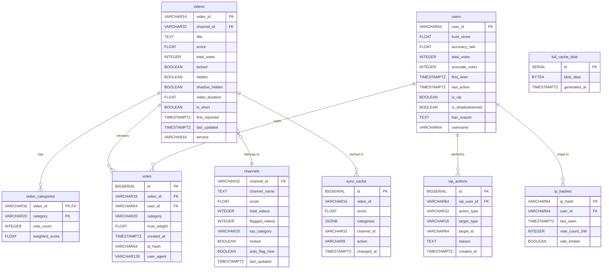

# SUB-DOC 5: Database Design

## Entity Relationship Diagram



## 8. Database Schema

```sql
-- ============================================================
-- CORE TABLES
-- ============================================================

-- Videos table: stores all reported videos with aggregated scores
CREATE TABLE videos (
    video_id        VARCHAR(16) PRIMARY KEY,       -- YouTube video ID
    channel_id      VARCHAR(32),                    -- YouTube channel ID
    title           TEXT,                            -- Video title (optional, for display)
    score           FLOAT DEFAULT 0.0,              -- Aggregate AI confidence score (0-100)
    total_votes     INTEGER DEFAULT 0,              -- Total vote count
    locked          BOOLEAN DEFAULT FALSE,          -- VIP-locked (immutable)
    hidden          BOOLEAN DEFAULT FALSE,          -- Admin-hidden
    shadow_hidden   BOOLEAN DEFAULT FALSE,          -- Submitter shadowbanned
    video_duration  FLOAT,                          -- Duration in seconds
    is_short        BOOLEAN DEFAULT FALSE,          -- YouTube Short flag
    first_reported  TIMESTAMPTZ DEFAULT NOW(),      -- First report timestamp
    last_updated    TIMESTAMPTZ DEFAULT NOW(),      -- Last score recalculation
    service         VARCHAR(16) DEFAULT 'youtube'   -- Platform (future: tiktok, etc.)
);

CREATE INDEX idx_videos_channel ON videos(channel_id);
CREATE INDEX idx_videos_score ON videos(score) WHERE score >= 50;
CREATE INDEX idx_videos_last_updated ON videos(last_updated);
CREATE INDEX idx_videos_hash_prefix ON videos(encode(sha256(video_id::bytea), 'hex'));

-- Category votes per video: tracks per-category vote aggregates
CREATE TABLE video_categories (
    video_id        VARCHAR(16) REFERENCES videos(video_id) ON DELETE CASCADE,
    category        VARCHAR(20) NOT NULL,           -- fully_ai, ai_voiceover, ai_visuals, ai_thumbnails, ai_assisted
    vote_count      INTEGER DEFAULT 0,
    weighted_score  FLOAT DEFAULT 0.0,              -- Trust-weighted score for this category
    PRIMARY KEY (video_id, category)
);

-- Individual vote records
CREATE TABLE votes (
    id              BIGSERIAL PRIMARY KEY,
    video_id        VARCHAR(16) NOT NULL REFERENCES videos(video_id) ON DELETE CASCADE,
    user_id         VARCHAR(64) NOT NULL,            -- SHA256-hashed public user ID
    category        VARCHAR(20) NOT NULL,            -- AI category voted for
    trust_weight    FLOAT NOT NULL,                  -- User's trust score at time of vote
    created_at      TIMESTAMPTZ DEFAULT NOW(),
    ip_hash         VARCHAR(64),                     -- Salted SHA256 of IP (abuse prevention)
    user_agent      VARCHAR(128),                    -- Client identifier

    CONSTRAINT unique_vote_per_user UNIQUE(video_id, user_id)
);

CREATE INDEX idx_votes_video ON votes(video_id);
CREATE INDEX idx_votes_user ON votes(user_id);

-- ============================================================
-- CHANNEL AGGREGATION
-- ============================================================

-- Channels table: auto-aggregated from video scores
CREATE TABLE channels (
    channel_id      VARCHAR(32) PRIMARY KEY,
    channel_name    TEXT,
    score           FLOAT DEFAULT 0.0,              -- Aggregate channel AI score (0-100)
    total_videos    INTEGER DEFAULT 0,              -- Total videos with any votes
    flagged_videos  INTEGER DEFAULT 0,              -- Videos above threshold
    top_category    VARCHAR(20),                    -- Most common AI category
    locked          BOOLEAN DEFAULT FALSE,
    auto_flag_new   BOOLEAN DEFAULT FALSE,          -- Auto-flag new uploads from this channel
    last_updated    TIMESTAMPTZ DEFAULT NOW()
);

-- ============================================================
-- USER TRUST & MODERATION
-- ============================================================

-- Users table: trust scores and metadata per extension install
CREATE TABLE users (
    user_id             VARCHAR(64) PRIMARY KEY,     -- SHA256-hashed public ID
    trust_score         FLOAT DEFAULT 0.3,           -- 0.0 to 1.0
    accuracy_rate       FLOAT DEFAULT 0.5,           -- Historical accuracy
    total_votes         INTEGER DEFAULT 0,
    accurate_votes      INTEGER DEFAULT 0,
    first_seen          TIMESTAMPTZ DEFAULT NOW(),
    last_active         TIMESTAMPTZ DEFAULT NOW(),
    is_vip              BOOLEAN DEFAULT FALSE,
    is_shadowbanned     BOOLEAN DEFAULT FALSE,
    ban_reason          TEXT,
    username            VARCHAR(64)                   -- Optional display name
);

-- VIP action log: audit trail for moderator actions
CREATE TABLE vip_actions (
    id              BIGSERIAL PRIMARY KEY,
    vip_user_id     VARCHAR(64) REFERENCES users(user_id),
    action_type     VARCHAR(32) NOT NULL,            -- lock, unlock, hide, shadowban, etc.
    target_type     VARCHAR(16) NOT NULL,            -- video, channel, user
    target_id       VARCHAR(64) NOT NULL,
    reason          TEXT,
    created_at      TIMESTAMPTZ DEFAULT NOW()
);

-- ============================================================
-- IP TRACKING (abuse prevention)
-- ============================================================

CREATE TABLE ip_hashes (
    ip_hash         VARCHAR(64) PRIMARY KEY,         -- Salted SHA256 of IP
    user_id         VARCHAR(64),
    last_seen       TIMESTAMPTZ DEFAULT NOW(),
    vote_count_24h  INTEGER DEFAULT 0,
    rate_limited    BOOLEAN DEFAULT FALSE
);

-- ============================================================
-- CACHE TABLES
-- ============================================================

-- Materialized cache for sync endpoints
CREATE TABLE sync_cache (
    id              BIGSERIAL PRIMARY KEY,
    video_id        VARCHAR(16) NOT NULL,
    score           FLOAT NOT NULL,
    categories      JSONB NOT NULL,
    channel_id      VARCHAR(32),
    action          VARCHAR(8) DEFAULT 'update',     -- update or remove
    changed_at      TIMESTAMPTZ DEFAULT NOW()
);

CREATE INDEX idx_sync_cache_changed ON sync_cache(changed_at);

-- Full blob cache (regenerated periodically)
CREATE TABLE full_cache_blob (
    id              SERIAL PRIMARY KEY,
    blob_data       BYTEA NOT NULL,                  -- Gzipped JSON
    generated_at    TIMESTAMPTZ DEFAULT NOW()
);
```
