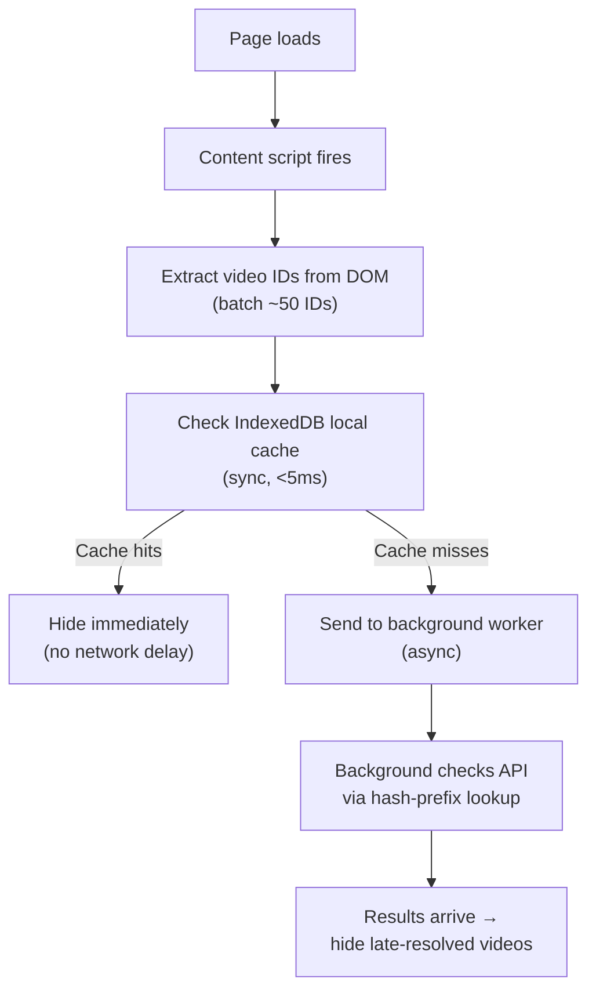

# SUB-DOC 1: Extension Design

## 4. Extension Design

### 4.1 Content Script (`content.ts`)

The content script is the core of the extension. It injects into YouTube pages and handles:

**Video Detection:**
- Monitor URL changes (YouTube is a SPA, uses History API)
- Extract video IDs from URLs, thumbnails, and data attributes
- Detect page type: home feed, search results, watch page, Shorts, channel page

**Hiding Logic:**
- On feed/search pages: query local cache for each visible video ID
- If flagged above user's threshold: remove the DOM element (video card/thumbnail)
- On watch page: show interstitial warning or redirect back
- On Shorts: intercept short and skip to next
- Use MutationObserver to catch dynamically loaded content (infinite scroll)

**DOM Manipulation Targets:**

| Page Type | DOM Selectors |
|-----------|---------------|
| Feed page | `ytd-rich-item-renderer`, `ytd-video-renderer` |
| Search results | `ytd-video-renderer` |
| Watch sidebar | `ytd-compact-video-renderer` |
| Shorts | `ytd-reel-video-renderer` |
| Channel page | `ytd-grid-video-renderer` |

**Vote Submission UI:**
- Inject a RealTube button into the video player controls (similar to SponsorBlock)
- On click: show category selector overlay
- Categories displayed as radio buttons with icons
- Submit sends message to background worker

### 4.2 Background Service Worker (`background.ts`)

**Message Hub:**
- Listen for messages from content script, popup, and options page
- Route API requests through centralized client
- Manage authentication (extension ID generation and storage)

**API Client:**
- Communicate with RealTube server
- Handle retries with exponential backoff
- Queue requests when offline, flush on reconnect

**Local Cache (IndexedDB):**
- Store flagged video IDs with their scores and categories
- Delta sync: fetch only changes since last sync (every 30 minutes)
- Full refresh: complete cache rebuild every 24 hours
- Cache structure:
  ```
  videos: { videoId, score, categories, channelId, lastUpdated }
  channels: { channelId, score, videoCount, flaggedCount, lastUpdated }
  pendingVotes: { videoId, category, timestamp } (offline queue)
  ```

**Batch Lookups:**
- Content script sends batch of video IDs visible on page
- Background worker checks local cache first
- For cache misses: batch API request using hash-prefix lookup
- Return results to content script for DOM manipulation

### 4.3 Popup UI (`popup.tsx` - React)

**Components:**
- **StatusBar** -- Extension enabled/disabled toggle, connection status
- **CurrentVideoInfo** -- If on a watch page, show current video's AI score and category breakdown
- **QuickVote** -- One-click voting for current video
- **UserStats** -- User's trust score, total votes submitted, accuracy rate
- **CacheInfo** -- Last sync time, cached video count, manual refresh button

### 4.4 Options Page (`options.tsx` - React)

**Settings Sections:**
- **General** -- Enable/disable, Shorts filtering toggle, default action (hide/warn/dim/ignore)
- **Categories** -- Per-category thresholds (e.g., hide fully_ai at 60% confidence, warn ai_voiceover at 80%)
- **Appearance** -- Badge style, notification preferences
- **Privacy** -- Hash-prefix mode toggle, data collection info
- **Advanced** -- Server URL override, cache TTL, debug logging
- **About** -- Version, user ID (anonymized), trust score, links

### 4.5 Manifest Strategy

**Manifest V3 (Chrome, Edge, Safari):**
```json
{
  "manifest_version": 3,
  "name": "RealTube",
  "permissions": ["storage", "scripting"],
  "host_permissions": ["*://www.youtube.com/*", "*://youtube.com/*", "*://m.youtube.com/*"],
  "background": { "service_worker": "background.js" },
  "content_scripts": [{ "matches": ["*://www.youtube.com/*"], "js": ["content.js"] }],
  "action": { "default_popup": "popup.html" }
}
```

**Manifest V2 (Firefox fallback if needed):**
- `background.scripts` instead of `service_worker`
- `browser_action` instead of `action`
- `web_accessible_resources` as array instead of object

**Build Strategy:**
- Base manifest shared across all browsers
- Browser-specific extras merged at build time (same pattern as SponsorBlock)
- Webpack/Vite config per target browser

---

## 20. Extension Performance

### Performance Budget

| Operation | Target | Strategy |
|-----------|--------|----------|
| Cache lookup (50 IDs) | <5ms | IndexedDB local cache |
| DOM manipulation (hide 20 cards) | <4ms | `display:none` per element |
| MutationObserver callback | <10ms | Debounced at 100ms intervals |
| Background API call | Non-blocking | Async via service worker |
| Popup load | <200ms | Lazy-loaded React bundle (~200KB) |
| Memory footprint | <15MB | IndexedDB (~10MB) + working set (~5MB) |

### Cache-First Architecture



### MutationObserver Strategy

```typescript
// Observe only the feed container, not entire document
const observer = new MutationObserver(debounce((mutations) => {
  const newVideoIds = extractVideoIds(mutations);
  if (newVideoIds.length > 0) checkAndHide(newVideoIds);
}, 100));

observer.observe(feedContainer, { childList: true, subtree: true });
```

### Key Rules

- Never block main thread -- all API calls via background worker
- Content script never makes fetch calls directly
- IndexedDB reads batched
- Popup React app lazy-loaded on click
- Minimal injected CSS (hiding rules only)
