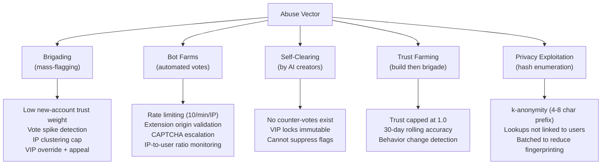

# SUB-DOC 8: Security Design

## 13. Privacy & Security

### Privacy Measures

1. **Anonymous extension IDs**: Randomly generated UUID, never linked to user identity
2. **Hashed public IDs**: 5000-iteration SHA256 of local ID before sending to server
3. **Hash-prefix video lookups**: Client sends 4-8 char prefix of SHA256(videoId), server returns all matches, client filters locally. Server never knows exact video being checked
4. **IP hashing**: IPs salted and hashed (5000 iterations) for abuse prevention only
5. **No personal data**: No names, emails, browsing history, or account system
6. **Minimal permissions**: Extension only needs access to youtube.com

### Security Measures

1. **Input validation**: All API inputs validated and sanitized
2. **SQL injection prevention**: Parameterized queries only
3. **CORS**: Restrict to extension origins + public API consumers
4. **Rate limiting**: Per-IP and per-user at NGINX and application level
5. **TLS**: HTTPS only in production
6. **Content Security Policy**: Extension CSP prevents XSS
7. **Message validation**: Content script messages validated in background worker

---

## 19. Abuse & Gaming Vectors

### Attack 1: Brigading (coordinated mass-flagging of legitimate creators)

A group targets a human creator's videos with false AI flags.

**Defenses:**
- New accounts have low trust weight (0.3x for first 60 days)
- Sudden vote spike detection: 10x normal vote rate within 1 hour triggers VIP review
- IP clustering: votes from same /24 subnet on same video get capped combined weight
- VIP override: moderators can lock videos as "confirmed human"
- Creator appeal process for review

### Attack 2: Bot farms (automated vote submission)

**Defenses:**
- Rate limiting: 10 votes/min per IP, per user ID
- Extension origin validation: votes must include valid `chrome.runtime.id` header
- CAPTCHA escalation for unusual voting patterns
- IP-to-user ratio monitoring: flag IPs with 50+ unique user IDs
- Minimum engagement time: extension must be active on video page for 5+ seconds before vote allowed

### Attack 3: Self-clearing by AI slop creators

**Defenses:**
- No "not AI" counter-vote exists. Only positive flags (mark as AI). Absence of flags = not flagged
- VIP-locked flags cannot be undone by regular votes
- Creators cannot suppress others from flagging their content

### Attack 4: Trust farming (build trust, then brigade)

**Defenses:**
- Trust capped at 1.0x (VIP is 3.0x) -- diminishing returns
- 30-day rolling accuracy window -- old accuracy doesn't persist
- Behavior change detection: consistent accurate votes followed by controversial votes triggers review

### Attack 5: Privacy exploitation via hash-prefix enumeration

**Defenses:**
- 4-8 character prefix returns many matches (k-anonymity)
- Hash lookups not associated with user IDs in server logs
- Extension batches lookups to reduce fingerprinting surface
