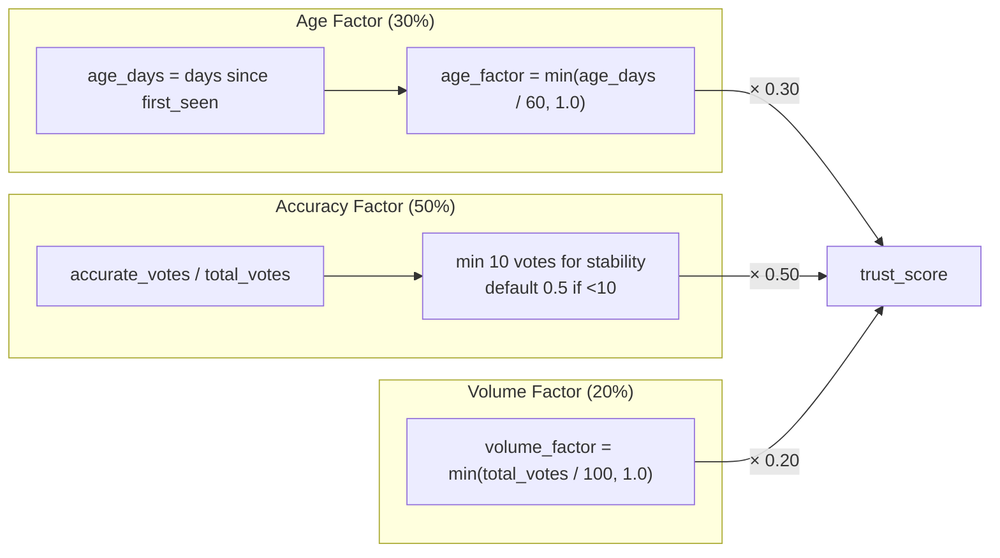
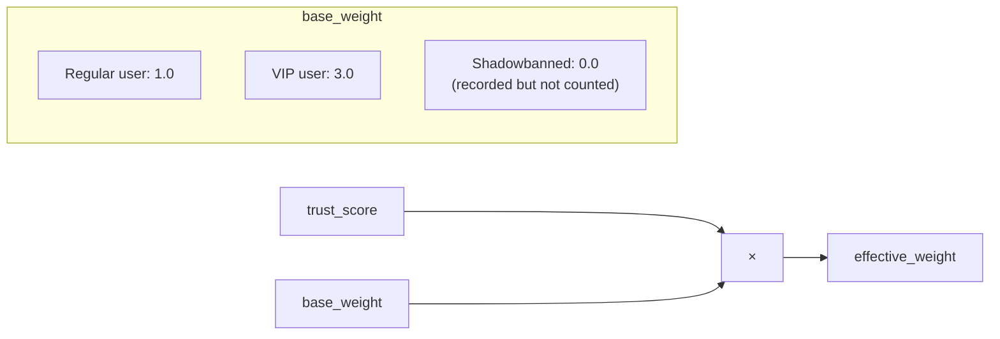
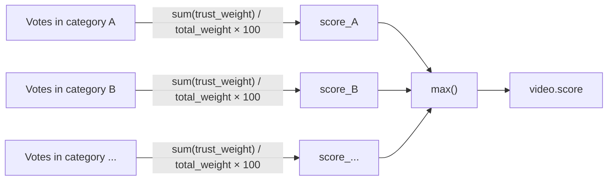
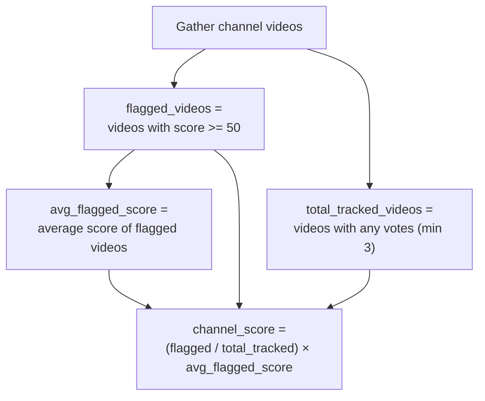
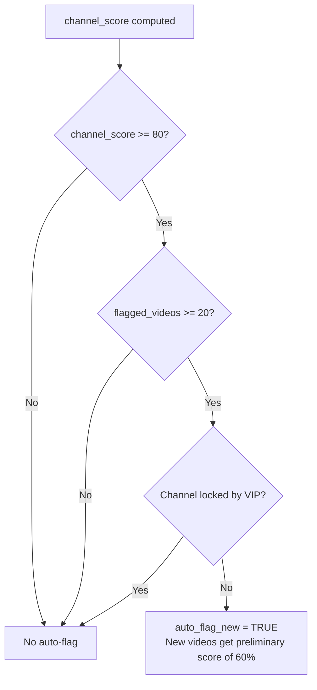
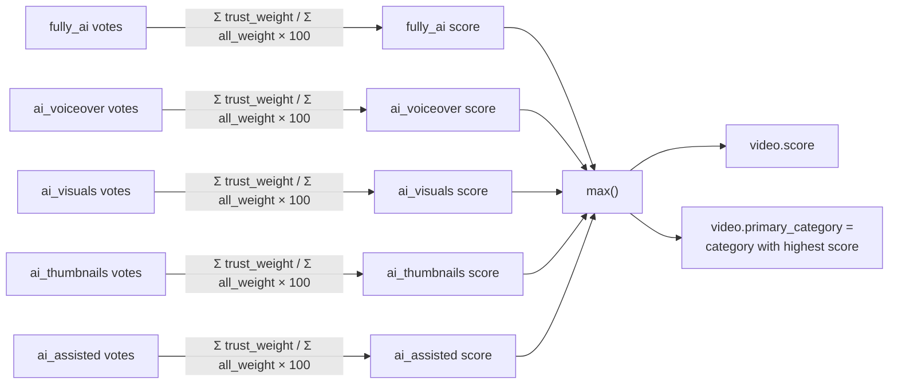

# SUB-DOC 6: Trust System Design

## 9. Voting, Trust & Reputation System

### Trust Score Algorithm

Each user has a trust score from 0.0 to 1.0 that weights their votes:



**Age Factor (30%):**
- New accounts start at 0.0, reach full weight after 60 days
- Prevents new-account brigading

**Accuracy Factor (50%):**
- A vote is "accurate" if the video's final score aligns with the vote direction
- Evaluated in 30-day rolling windows
- Users below 10 votes get default 0.5 accuracy

**Volume Factor (20%):**
- Rewards consistent contributors
- Full weight at 100+ lifetime votes

### Vote Weighting

When a user votes, their trust score determines the vote's weight:



### Video Score Calculation



### Thresholds

| Condition | Threshold |
|-----------|-----------|
| Video flagged (shown to users) | score >= 50% |
| Video strongly flagged | score >= 80% |
| Channel auto-flagged | >= 60% of videos with score >= 50% |
| Channel new-video auto-flag | channel score >= 80% AND >= 20 flagged videos |
| VIP single-vote lock | VIP votes immediately lock at score = 95% |

### Anti-Abuse Measures

1. **New account throttling** -- Low trust score for first 60 days
2. **IP-based rate limiting** -- Max 10 votes per minute per IP
3. **Duplicate prevention** -- One vote per user per video (can change, not stack)
4. **Shadowbanning** -- Abusive users' votes silently ignored
5. **VIP override** -- Trusted moderators can lock/unlock flags
6. **Accuracy decay** -- Trust decreases if votes consistently disagree with consensus
7. **Brigading detection** -- Flag when many new accounts vote on same video in short window

---

## 10. Channel Aggregation Algorithm

Channel scores are **automatically computed** from their videos' individual scores. No separate channel voting.

### Computation



### Auto-Flagging New Videos

When a channel reaches the auto-flag threshold:



New videos from auto-flagged channels receive a **preliminary score of 60%** (visible to users as "likely AI") until they receive enough independent votes to establish their own score. This preliminary score can be overridden by community votes in either direction.

### Recalculation Trigger

Channel scores are recalculated:
- When any video in the channel receives a new vote
- On a periodic background job (every 15 minutes)
- When a VIP modifies a video's lock status

---

## 11. AI Categories & Confidence Scoring

### Categories

| Category | Code | Description | Severity |
|----------|------|-------------|----------|
| Fully AI-Generated | `fully_ai` | Entire video is AI: visuals, audio, script | Highest |
| AI Voiceover | `ai_voiceover` | Real/stock footage with AI-generated narration | High |
| AI Visuals | `ai_visuals` | AI-generated images/video with human voice | High |
| AI Thumbnails Only | `ai_thumbnails` | Only thumbnail is AI-generated, content is human | Low |
| AI-Assisted | `ai_assisted` | Significant AI editing/enhancement beyond normal tools | Medium |

### Confidence Score Computation

Each category gets its own weighted score. The video's overall confidence is the **maximum** across categories:



### User-Side Filtering

Users configure per-category thresholds in extension settings:

```
Default settings:
  fully_ai:       hide at >= 50%
  ai_voiceover:   hide at >= 60%
  ai_visuals:     hide at >= 60%
  ai_thumbnails:  warn at >= 70% (don't hide by default)
  ai_assisted:    warn at >= 80% (don't hide by default)
```

Users can adjust these individually, or use presets:
- **Strict**: Hide everything >= 40%
- **Balanced**: Default settings above
- **Relaxed**: Only hide fully_ai >= 70%
