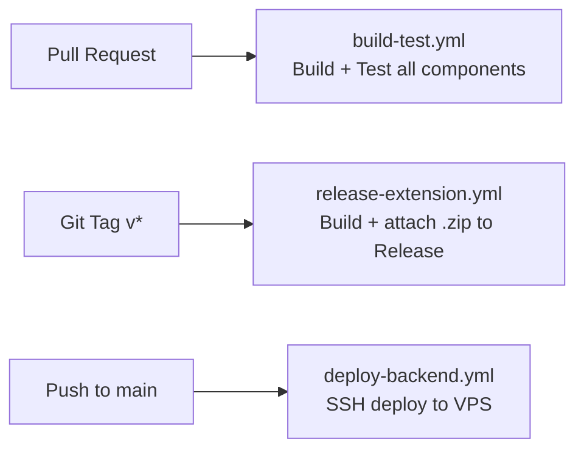

# RealTube — Rollout & Release Plan

This document covers everything needed to take RealTube from local development to a live, publicly available product: hosting the backend, publishing the extension to browser stores, setting up CI/CD, and executing a phased rollout.

---

## Table of Contents

1. [Hosting & Infrastructure](#1-hosting--infrastructure)
2. [Production Docker Compose Changes](#2-production-docker-compose-changes)
3. [Extension Store Publishing](#3-extension-store-publishing)
4. [CI/CD Pipeline (GitHub Actions)](#4-cicd-pipeline-github-actions)
5. [Pre-Launch Checklist](#5-pre-launch-checklist)
6. [Rollout Phases](#6-rollout-phases)

---

## 1. Hosting & Infrastructure

### VPS Provider Comparison

The full Docker Compose stack (NGINX + Go + Python + PostgreSQL + Redis + db-exporter) runs comfortably on a small VPS. All three providers below offer hourly billing and easy snapshots.

| Provider | Plan | vCPU | RAM | Disk | Transfer | Price/mo |
|----------|------|------|-----|------|----------|----------|
| **Hetzner** (EU/US) | CX22 | 2 | 4 GB | 40 GB NVMe | 20 TB | ~$4.50 |
| **DigitalOcean** | Basic Droplet | 2 | 2 GB | 50 GB SSD | 3 TB | $12 |
| **Vultr** | Cloud Compute | 2 | 2 GB | 50 GB NVMe | 3 TB | $12 |

**Recommendation:** Hetzner CX22 offers the best price-to-performance ratio for a bootstrapped project. Start with 4 GB RAM (PostgreSQL and Redis both benefit from memory). Scale vertically or add a second node later if needed.

**Minimum requirements:** 2 vCPU, 2 GB RAM, 20 GB disk. The Go backend image is ~15 MB, Python ~150 MB, PostgreSQL and Redis are lightweight at low traffic. The bottleneck will be database size as votes accumulate.

### Domain & DNS

1. **Register a domain** — Cloudflare Registrar (at-cost pricing, built-in DNS/CDN) or Namecheap (cheap `.com`/.`org` domains).
2. **DNS records:**

   | Type | Name | Value | TTL |
   |------|------|-------|-----|
   | A | `api.realtube.example` | `<VPS_IP>` | 300 |
   | A | `realtube.example` (optional landing page) | `<VPS_IP>` or external host | 300 |

3. If using Cloudflare, enable **DNS-only mode** (grey cloud) initially — let the VPS handle TLS directly to keep things simple.

### TLS/HTTPS

The existing `nginx.conf` already has HTTPS configured with certificate paths at `/etc/nginx/certs/`. For production, replace the self-signed dev certs with real ones:

**Option A — Certbot (with current NGINX setup):**
```bash
# Install certbot on the VPS
apt install certbot python3-certbot-nginx

# Obtain certificate (temporarily expose port 80 without redirect)
certbot certonly --standalone -d api.realtube.example

# Mount certs into the NGINX container
# In docker-compose.yml, update the nginx volumes:
#   - /etc/letsencrypt/live/api.realtube.example:/etc/nginx/certs:ro
```
Set up a cron job or systemd timer for `certbot renew`.

**Option B — Switch to Caddy (auto-TLS, zero config):**
Replace the NGINX container with Caddy, which handles Let's Encrypt automatically. This eliminates certificate management entirely but requires rewriting `nginx.conf` as a `Caddyfile`. Caddy can reverse-proxy identically to the current NGINX setup. Consider this if certificate renewal becomes a maintenance burden.

### Firewall

On the VPS, configure `ufw` (or equivalent):
```bash
ufw default deny incoming
ufw default allow outgoing
ufw allow 22/tcp    # SSH
ufw allow 80/tcp    # HTTP (redirect to HTTPS)
ufw allow 443/tcp   # HTTPS
ufw enable
```

PostgreSQL (5432) and Redis (6379) are already unexposed in `docker-compose.yml` — they have no `ports:` mapping and are only accessible via Docker's internal network.

---

## 2. Production Docker Compose Changes

### What's Already Hardened

The current `docker-compose.yml` already implements several production best practices:

- **Docker secrets** for PostgreSQL and Redis passwords (files in `./secrets/`, mounted via `/run/secrets/`)
- **No exposed database ports** — PostgreSQL and Redis have no `ports:` mapping
- **Security options** — `no-new-privileges:true` and `cap_drop: ALL` on both backends and db-exporter
- **Health checks** on all service containers
- **Named volumes** (`postgres_data`, `redis_data`) for data persistence

### Environment Variable Checklist for Production

Update these values when deploying:

| Variable | Dev Value | Production Value |
|----------|-----------|------------------|
| `ENVIRONMENT` | `development` | `production` |
| `LOG_LEVEL` | `info` | `info` (or `warn` to reduce noise) |
| `POSTGRES_SSLMODE` | `prefer` | `require` (if using external DB) or `prefer` (local Docker) |
| `CORS_ORIGINS` | `chrome-extension://*,moz-extension://*,http://localhost:*` | Specific extension IDs after store publish (see below) |

After Chrome/Firefox store approval, you'll receive fixed extension IDs. Update `CORS_ORIGINS` to:
```
chrome-extension://<CHROME_EXTENSION_ID>,moz-extension://<FIREFOX_EXTENSION_UUID>
```

### Remove Dev-Only Port Mappings

In production, remove the direct backend port mappings since all traffic goes through NGINX:
```yaml
# REMOVE these from go-backend and python-backend:
ports:
  - "8080:8080"   # go-backend — remove
  - "8081:8081"   # python-backend — remove
```

NGINX (ports 80/443) is the only service that needs host port exposure.

### PostgreSQL Backup Strategy

The `db-exporter` service already runs daily `pg_dump` to `./exports/`. For production:

1. **Keep the db-exporter** running as-is for daily dumps.
2. **Off-site backups** — Add a cron job on the VPS to sync `./exports/` to object storage:
   ```bash
   # Example: sync to Hetzner Storage Box, Backblaze B2, or S3-compatible storage
   rclone sync /path/to/exports remote:realtube-backups --max-age 7d
   ```
3. **Retention** — Keep 7 daily dumps locally, 30 days in object storage.
4. **Test restores** periodically:
   ```bash
   pg_restore -d realtube_test /exports/realtube-YYYYMMDD.dump
   ```

### Log Aggregation

Both backends output structured JSON logs (zerolog for Go, structlog for Python). For a single-VPS deployment:

- **Minimal:** Use `docker compose logs -f` and `docker compose logs --since 1h` for debugging. Logs rotate automatically via Docker's default json-file driver.
- **Better:** Add a log driver config to `docker-compose.yml` for size limits:
  ```yaml
  logging:
    driver: json-file
    options:
      max-size: "10m"
      max-file: "5"
  ```
- **Full stack (later):** Loki + Grafana for log search and dashboards, or ship to a hosted service (Betterstack, Axiom free tier).

---

## 3. Extension Store Publishing

### Build Artifacts

The extension build produces store-ready outputs:

```bash
cd realtube-extension
npm run build          # Builds both browsers
# Output:
#   dist/chrome/       → Chrome Web Store / Edge Add-ons
#   dist/firefox/      → Firefox Add-ons (AMO)
```

Before building for submission, update the API URL in the extension source from `localhost` to the production domain (`https://api.realtube.example`).

### Store Listing Assets (Needed for All Stores)

| Asset | Spec |
|-------|------|
| Extension icon | Already in `src/icons/` — 16, 48, 128px PNG |
| Screenshot(s) | 1280x800 or 640x400 — show the extension in action on YouTube |
| Description | Short (132 chars) + detailed. Current manifest: *"Community-powered AI content detection for YouTube. Flag and hide AI-generated videos from your feed."* |
| Privacy policy URL | **Required by Chrome Web Store.** Host at `https://realtube.example/privacy` or as a GitHub Pages page. |
| Category | Chrome: "Productivity" or "Social & Communication". Firefox: "Privacy & Security". |

### Chrome Web Store

1. **Developer account:** Sign up at [Chrome Web Store Developer Dashboard](https://chrome.google.com/webstore/devconsole). One-time $5 registration fee.
2. **Package:** Zip the `dist/chrome/` directory:
   ```bash
   cd dist/chrome && zip -r ../../realtube-chrome.zip .
   ```
3. **Submit:**
   - Upload the `.zip` to the developer dashboard.
   - Fill in listing info: description, screenshots, category, privacy policy URL.
   - Declare permissions justification (`storage` for settings, `host_permissions` for YouTube content modification).
4. **Review:** Typically 1-3 business days for initial submission. Updates are usually faster (hours to 1 day).
5. **Updates:** Upload a new `.zip` with an incremented `version` in `manifest.chrome.json`. Version must be higher than the published version.
6. **Post-approval:** Chrome assigns a fixed extension ID (`chrome-extension://<32-char-id>`). Update the backend's `CORS_ORIGINS` with this ID.

### Firefox Add-ons (AMO)

1. **Developer account:** Sign up at [Firefox Add-on Developer Hub](https://addons.mozilla.org/developers/). Free — no registration fee.
2. **Package:** Zip the `dist/firefox/` directory:
   ```bash
   cd dist/firefox && zip -r ../../realtube-firefox.zip .
   ```
3. **Submit:**
   - Upload the `.zip` to AMO.
   - AMO may request source code upload for review (since the extension uses webpack). Keep the full source repo accessible — or upload a source `.zip` alongside the built extension.
   - Fill in listing info similarly to Chrome.
4. **Review:** AMO has human reviewers. Initial review can take days to weeks. Automated signing for self-distributed versions is instant.
5. **Updates:** Upload a new `.zip` with incremented `version` in `manifest.firefox.json`.
6. **Firefox extension UUID:** After approval, AMO assigns a UUID. Update backend `CORS_ORIGINS` with `moz-extension://<UUID>`.

### Microsoft Edge Add-ons

1. **Developer account:** Sign up at [Edge Add-ons Developer Dashboard](https://partner.microsoft.com/dashboard/microsoftedge). Free.
2. **Package:** Use the same `dist/chrome/` zip — Edge uses Manifest V3 and is Chromium-compatible.
3. **Submit:** Same flow as Chrome. Edge review is typically 1-5 business days.
4. **No changes needed** to the extension code. The Chrome build works as-is on Edge.

### Safari — Deferred

Safari requires:
- macOS with Xcode installed
- Apple Developer Program membership ($99/year)
- Conversion via `safari-web-extension-converter` tool
- Separate App Store review process

**Recommendation:** Defer Safari support to Phase 4. The extension would need a Manifest V2-to-Safari bridge and testing on macOS. Not worth the effort until there's demand.

---

## 4. CI/CD Pipeline (GitHub Actions)

### Workflow Overview

Three workflows covering build/test, extension release, and backend deployment:



### `build-test.yml` — On Pull Request

Triggered on every PR to `main`. Runs all three component builds and test suites in parallel.

**Jobs:**
- **go-backend:** `go build ./...` and `go test ./...`
- **python-backend:** `pip install -r requirements.txt` and `pytest`
- **extension:** `npm ci`, `npm run build`, `npm test` (vitest)

All three jobs run in parallel. PR is blocked from merging until all pass.

### `release-extension.yml` — On Git Tag

Triggered when a version tag is pushed (e.g., `v0.2.0`). Builds the extension for both browsers and attaches `.zip` files to a GitHub Release.

**Steps:**
1. Checkout code at the tagged commit.
2. `npm ci && npm run build` in `realtube-extension/`.
3. Zip `dist/chrome/` and `dist/firefox/` into `realtube-chrome-v0.2.0.zip` and `realtube-firefox-v0.2.0.zip`.
4. Create a GitHub Release with the tag name and attach both `.zip` files.

The `.zip` files can then be uploaded to the respective store dashboards.

### `deploy-backend.yml` — On Push to Main

Triggered on pushes to `main` (after PR merge). Deploys the backend to the VPS via SSH.

**Steps:**
1. SSH into the VPS using a repository secret (`SSH_PRIVATE_KEY`).
2. `cd /opt/realtube && git pull origin main`
3. `docker compose up -d --build` (rebuilds only changed images).
4. `docker compose ps` to verify all services are healthy.

**Secrets needed in GitHub repo settings:**
- `SSH_PRIVATE_KEY` — Private key for VPS access
- `VPS_HOST` — VPS IP or hostname
- `VPS_USER` — SSH username (e.g., `deploy`)

### Version Management

Keep versions in sync across these files:

| File | Version Field |
|------|--------------|
| `realtube-extension/package.json` | `"version": "0.1.0"` |
| `realtube-extension/src/manifest.chrome.json` | `"version": "0.1.0"` |
| `realtube-extension/src/manifest.firefox.json` | `"version": "0.1.0"` |

All three must match. When cutting a release:
1. Bump the version in all three files.
2. Commit: `git commit -m "Bump version to 0.2.0"`
3. Tag: `git tag v0.2.0`
4. Push: `git push origin main --tags`

This triggers both `deploy-backend.yml` (push to main) and `release-extension.yml` (new tag).

---

## 5. Pre-Launch Checklist

### Backend

- [ ] Health checks pass: `GET /health/live` returns 200, `GET /health/ready` shows all checks green
- [ ] Rate limits tuned for real traffic (current: 100 req/min API, 10 req/min votes, 2 req/min sync)
- [ ] `CORS_ORIGINS` updated with actual Chrome/Firefox extension IDs
- [ ] `ENVIRONMENT=production` set in docker-compose environment
- [ ] Secrets files (`./secrets/postgres_password`, `./secrets/redis_password`) contain strong, unique passwords
- [ ] NGINX TLS certs are valid Let's Encrypt certificates (not self-signed)
- [ ] NGINX `server_name` updated from `_` to actual domain
- [ ] `db-exporter` running and producing daily dumps in `./exports/`
- [ ] Off-site backup configured and tested

### Extension

- [ ] API base URL updated from `localhost` to production domain (`https://api.realtube.example`)
- [ ] `connect-src` in `content_security_policy` updated to allow the production domain
- [ ] Extension tested against production API (not just local Docker)
- [ ] All icons present (16, 48, 128px) and display correctly in browser toolbar

### Database

- [ ] All migrations applied (9 tables across 3 migration files)
- [ ] Indexes verified: `\di` in psql shows all expected indexes
- [ ] No leftover test data from development

### Monitoring

- [ ] Uptime monitoring configured (free tier: [UptimeRobot](https://uptimerobot.com/) or [Healthchecks.io](https://healthchecks.io/))
  - Monitor `https://api.realtube.example/health/live` every 5 minutes
  - Alert via email or Discord webhook on downtime
- [ ] Docker log rotation configured (`max-size: 10m`, `max-file: 5`)
- [ ] Disk usage alert set (avoid filling disk with logs/exports)

### Legal

- [ ] **Privacy policy page** published (required by Chrome Web Store)
  - Must disclose: data collected (anonymous user IDs, votes, IP hashes), data storage, no PII collection
  - Host at `https://realtube.example/privacy` or GitHub Pages
- [ ] Extension description accurately describes functionality and permissions

---

## 6. Rollout Phases

### Phase 1 — Closed Beta

**Goal:** Validate the full stack end-to-end with real users.

- Deploy backend to VPS with Docker Compose
- Share the extension as "Load unpacked" (Chrome) or temporary add-on (Firefox) with 5-10 testers
- Collect feedback on:
  - Extension performance on YouTube (DOM observation, feed scanning)
  - Voting flow and category selection
  - Sync reliability (delta/full sync timing)
  - False positives in hiding behavior
- Fix critical bugs before store submission

**Duration:** 1-2 weeks.

### Phase 2 — Store Submission

**Goal:** Get the extension approved and available for install.

- Submit to **Chrome Web Store** and **Firefox Add-ons** simultaneously
- Use "Unlisted" visibility on Chrome initially (accessible via direct link, not searchable)
- Update backend CORS with assigned extension IDs after approval
- Expand beta to 20-50 users via direct link sharing
- Monitor server load, error rates, and vote accuracy at larger scale

**Duration:** 1-3 weeks (mostly waiting for store review).

### Phase 3 — Public Launch

**Goal:** Make the extension discoverable and attract organic users.

- Switch Chrome Web Store listing from "Unlisted" to "Public"
- Ensure Firefox listing is publicly visible on AMO
- Submit to **Microsoft Edge Add-ons** (Chrome build, minimal effort)
- Share on:
  - Reddit: r/youtube, r/browsers, r/privacy, r/ArtificialIntelligence
  - Hacker News (Show HN)
  - YouTube communities / Discord servers concerned with AI content
- Monitor for abuse patterns (brigading, fake votes, coordinated flagging)
- Scale VPS if traffic exceeds capacity

### Phase 4 — Post-Launch Iteration

**Goal:** Stabilize, expand, and iterate based on real usage data.

- **Monitoring:** Add Prometheus + Grafana if request volume justifies it
- **Performance:** Tune PostgreSQL (`work_mem`, `shared_buffers`) based on actual query patterns
- **Trust system:** Observe trust score distribution, adjust weights if gaming is detected
- **Safari:** Evaluate demand — implement if there's significant user request
- **Edge:** Monitor Edge Add-ons adoption (likely low effort, same Chrome build)
- **API versioning:** If breaking changes are needed, implement `/api/v2/` alongside `/api/v1/`
- **Public database export:** Ensure the daily `pg_dump` export endpoint works for third-party consumers (as documented in `public-api-docs.md`)
